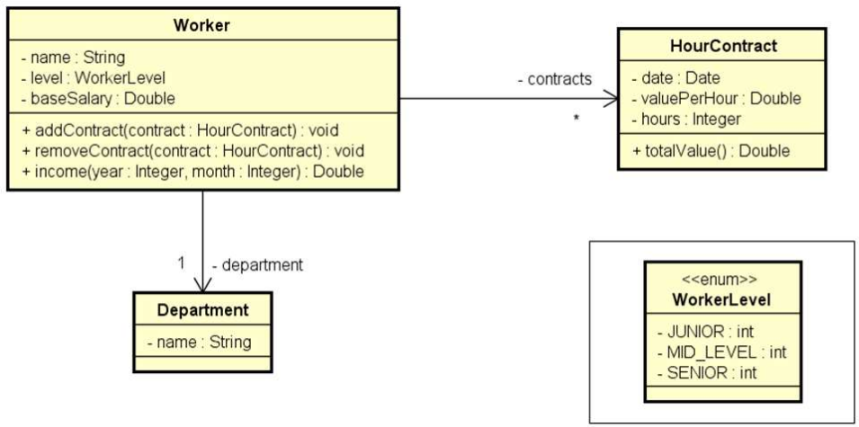

# Problema "Trabalhador e Contratos"

Ler os dados de um trabalhador com N contratos (N fornecido pelo usuário). Depois, solicitar do usuário um mês e mostrar
qual foi o salário do funcionário nesse mês, conforme exemplo.

## Exemplo de entrada e saída

### Entrada

| Entrada                                | Exemplo 1  |
|:---------------------------------------|:-----------|
| **Enter department's name:**           | Design     |
| **Name:**                              | Alex       |
| **Level:**                             | MID_LEVEL  |
| **Base salary:**                       | 1200.00    |
| **How many contracts to this worker?** | 3          |
| **Contract #1 Date (DD/MM/YYYY):**     | 20/08/2018 |
| **Contract #1 Value per hour:**        | 50.00      |
| **Contract #1 Duration (hours):**      | 20         |
| **Contract #2 Date (DD/MM/YYYY):**     | 13/06/2018 |
| **Contract #2 Value per hour:**        | 30.00      |
| **Contract #2 Duration (hours):**      | 18         |
| **Contract #3 Date (DD/MM/YYYY):**     | 25/08/2018 |
| **Contract #3 Value per hour:**        | 80.00      |
| **Contract #3 Duration (hours):**      | 10         |
| **Enter month and year (MM/YYYY):**    | 08/2018    |

### Saída

| Saída                   | Exemplo 1 |
|:------------------------|:----------|
| **Name:**               | Alex      |
| **Department:**         | Design    |
| **Income for 08/2018:** | 3000.00   |

## Utilize a modelagem abaixo para desenvolver a solução



## 🛠️ Tecnologias e Ferramentas

- **Linguagem:** Java (JDK 17+)
- **IDE:** IntelliJ IDEA
- **Controle de Versão:** Git & GitHub
- **Documentação:** Markdown
- **Qualidade de Código:** SonarQube for IDE

<br>


---

## 🚀 Como Executar o Projeto

1. Clone este repositório no seu terminal:

```bash
git clone https://github.com/ivanfsilva/ds-trabalhador-contratos.git
```

2. Importe o projeto para a sua IDE de preferência (Eclipse, IntelliJ IDEA, VS Code, etc.).
3. Navegue até o pacote `application` e abra o arquivo `Program.java`.
4. Execute a classe `Program`.
5. Interaja com o sistema através do console da sua IDE, inserindo os dados conforme o exemplo de entrada (lembre-se de
   utilizar ponto como separador decimal para os valores numéricos).

---

## 👤 Autor

Desenvolvido por Ivan Ferreira.

Copyright © 2026 Ivan Ferreira. Todos os direitos reservados.

## ☕ Sobre

Projeto prático desenvolvido durante os treinamentos de Java da plataforma ⚡**DevSuperior**, ministrados pelo Prof. Dr.
Nélio Alves.